# UX Design Specification: Auswanderer-Plattform

**Author:** Martin Zaremski
**Date:** 2026-01-18

---

## Core Experience Definition

### Gewünschte User-Gefühle

| Gefühl | Beschreibung |
|--------|--------------|
| **Neugier** | "Was kommt als nächstes?" - Der User will weitermachen |
| **Klarheit** | Jederzeit wissen wo man ist und was passiert |
| **Seriösität** | Vertrauen in die Analyse und die Plattform |
| **Entspannung** | Kein Stress, einfach zu bedienen |
| **Vorfreude** | Spannung auf das Ergebnis aufbauen |

### Zu vermeidende Gefühle

| Gefühl | Vermeidungsstrategie |
|--------|---------------------|
| **Overwhelmed** | Maximal eine Frage pro Screen |
| **Skeptisch** | Transparente Erklärungen, professionelles Design |
| **Verwirrt** | Klare Navigation, Fortschrittsanzeige |
| **Gelangweilt** | Visuelle Abwechslung, Emojis, kurze Fragen |

### UX-Prinzipien

1. **Ein Gedanke pro Screen** - Keine Überforderung
2. **Neugier als Motor** - Jeder Screen macht Lust auf den nächsten
3. **Transparente Navigation** - Zurück-Button + Fortschrittsanzeige
4. **Info on Demand** - Details nur für die, die sie wollen (ℹ️)
5. **Mobile-First** - Optimiert für Smartphone-Nutzung

---

## Desired Emotional Response

### Emotionales Journey-Mapping

| Phase | Emotion | Trigger |
|-------|---------|---------|
| **Landing** | Neugier + Vertrauen | Gründer-Story, klare Value Proposition |
| **Analyse-Start** | Motivation | "28 Fragen zu deinem Traumland" |
| **Fragen 1-10** | Flow | Einfache Fragen, schnelle Erfolge |
| **Fragen 11-20** | Engagement | Tiefere Fragen, persönlicher |
| **Fragen 21-27** | Vorfreude | "Fast geschafft!" |
| **Ergebnis-Loading** | Spannung | Dramatischer Ladebildschirm |
| **Teaser** | Peak-Spannung | 94% Match sichtbar, Land versteckt |
| **Nach Kauf** | Befriedigung | Vollständige Analyse enthüllt |

### Conversion-Optimized Reveal Strategy

1. **Loading-Screen**: "Deine Analyse wird berechnet..." (3-5 Sekunden)
2. **Teaser-Screen**: Zeigt 94% Match, Land ist 🔒
3. **CTA**: "Jetzt freischalten – 29,99€"
4. **Nach Kauf**: Land wird revealed + vollständige PDF-Analyse

---

## UX Pattern Analysis & Inspiration

### Inspirationsquellen

| App/Website | Gelerntes Pattern |
|-------------|-------------------|
| **Typeform** | Ein Gedanke pro Screen, Flow-Gefühl |
| **Duolingo** | Gamification, Progress-Tracking |
| **Spotify Wrapped** | Dramatischer Reveal, Personalisierung |
| **Stripe** | Seriöses, vertrauensvolles Design |

### Übernommene Patterns

- **Typeform-Style**: Vollbild-Fragen mit großer Typografie
- **Progress Bar**: Oben fixiert, zeigt Fortschritt
- **Rating Buttons**: 1-5 Scale mit "egal" / "sehr wichtig"
- **Reveal-Animation**: Dramatisches Enthüllen des Ergebnisses

---

## Design System Foundation

### Tech Stack

- **Framework**: Tailwind CSS + shadcn/ui
- **Fonts**: Google Fonts (Inter / Space Grotesk / DM Sans)
- **Icons**: Lucide Icons + Emojis für Kategorien
- **Animations**: CSS Transitions + Framer Motion

### Spacing System

- **Base**: 8px
- **Scale**: 4, 8, 12, 16, 24, 32, 48, 64, 96

### Border Radius

- **Small**: 8px (Buttons, Inputs)
- **Medium**: 12px (Cards)
- **Large**: 16px (Mobile Frames, Hero)
- **Full**: 9999px (Badges, Pills)

---

## Defining Core Experience

### Analyse-Flow

```
Landing → Start → 28 Fragen → Loading → Teaser → Kauf → Reveal
```

### Frage-Screen Struktur

```
┌─────────────────────────────────┐
│ ← Zurück           Frage 8/28  │
│ ████████░░░░░░░░░░░░░░░░ 30%   │
│                                 │
│              🌡️                │
│                                 │
│   Wie wichtig ist dir warmes   │
│            Klima?               │
│                                 │
│        ℹ️ Mehr erfahren         │
│                                 │
│    [1] [2] [3] [4] [5]         │
│   egal          sehr wichtig   │
│                                 │
└─────────────────────────────────┘
```

### Key Interactions

| Aktion | Verhalten |
|--------|-----------|
| **Rating wählen** | Sofort zur nächsten Frage (Auto-Advance) |
| **Zurück** | Vorherige Frage, Rating erhalten |
| **Info klicken** | Modal/Tooltip mit Erklärung |
| **Fortschritt** | Immer sichtbar oben |

---

## Visual Foundation

### Farbpalette

| Farbe | Hex | Verwendung |
|-------|-----|------------|
| **Primary** | #0F766E (Teal) | Buttons, Links, Progress |
| **Secondary** | #F59E0B (Amber) | CTAs, Highlights, Kauf-Buttons |
| **Background** | #FAFAF9 | Hintergrund |
| **Foreground** | #1C1917 | Text |
| **Muted** | #78716C | Sekundärer Text |
| **Success** | #16A34A | Positive Bestätigungen |
| **Border** | #E7E5E4 | Trennlinien, Rahmen |

### Typografie

| Stil | Größe | Gewicht | Verwendung |
|------|-------|---------|------------|
| **H1** | 36px | 700 | Hauptüberschriften |
| **H2** | 24px | 600 | Sektionsüberschriften |
| **H3** | 18px | 600 | Fragen |
| **Body** | 16px | 400 | Fließtext |
| **Small** | 14px | 400 | Hilfstexte, Labels |

### Button-Stile

| Typ | Aussehen |
|-----|----------|
| **Primary** | Teal Hintergrund, weiße Schrift |
| **Secondary** | Amber Hintergrund, weiße Schrift |
| **Outline** | Transparenter Hintergrund, Teal Border |

### Rating Buttons

- 5 quadratische Buttons (56x56px)
- Zahlen 1-5
- Hover: Teal Border + Scale(1.05)
- Selected: Teal Hintergrund, weiße Zahl

### Ergebnis-Teaser Karte

- Gradient: Teal → Dunkleres Teal
- Große 94% Zahl (64px)
- "Dein Top-Match" mit 🔒
- Amber CTA-Button "Jetzt freischalten – 29,99€"

---

## Design Preview

Eine interaktive HTML-Vorschau wurde erstellt:
`auswanderer-app/design-preview.html`

### Enthaltene Elemente

- Font-Switcher (Inter, Space Grotesk, DM Sans)
- Komplette Farbpalette
- Typografie-Scale
- Button-Varianten
- Rating Buttons mit Interaktion
- Fortschrittsanzeige
- Mobile Frage-Screen
- 94% Ergebnis-Teaser
- Landing Hero mit Mini-Demo

---

## Design Direction Decision

### Gewählte Design Direction

| Element | Entscheidung |
|---------|--------------|
| **Farbschema** | Teal (#0F766E) + Amber (#F59E0B) |
| **Font** | Inter (sicher, gut lesbar) |
| **Stil** | Clean, seriös, vertrauenswürdig |
| **Interaktion** | Auto-Advance nach Rating-Wahl |
| **Reveal-Strategie** | 94% Match → Kauf → Land enthüllen |

### Visuelle Elemente bei Fragen

| Phase | Ansatz | Begründung |
|-------|--------|------------|
| **MVP (Phase 1)** | Emojis | Schnell, kostenlos, funktioniert |
| **Nach Validierung (Phase 2)** | Custom Illustrationen | +25-40% Conversion, professioneller Look |

### Illustration-Roadmap (Phase 2)

- **Stil**: Flat Design oder Line Art
- **Format**: SVG (optimiert, schnell)
- **Anzahl**: 27 Illustrationen (eine pro Kriterium)
- **Beispiele**: Berge für Natur, Strand für Klima, Haus für Immobilien

### Design Rationale

1. **Emojis für MVP** - Schnelle Iteration, keine Designkosten
2. **Später Illustrationen** - Erst validieren, dann investieren
3. **Konsistenter Stil** - Alle Illustrationen im gleichen Look
4. **Performance** - SVGs laden schnell, gut für Mobile

---

## User Journey Flows

### Journey 1: Analyse-Flow

```mermaid
flowchart TD
    A[🏠 Landing Page] --> B{CTA: Analyse starten}
    B --> C[Frage 1/27]
    C --> D{Rating 1-5 wählen}
    D --> E[Auto-Advance]
    E --> F{Frage < 27?}
    F -->|Ja| G[Nächste Frage]
    G --> D
    F -->|Nein| H[⏳ Loading Screen]
    H --> I[🔒 Ergebnis-Teaser]
    I --> J{94% Match sichtbar}
    J --> K[Land versteckt 🔒]
    K --> L{CTA: Freischalten}
    L --> M[→ Kauf-Journey]
    
    C --> N{← Zurück?}
    N -->|Ja| O[Vorherige Frage]
    O --> D
    
    C --> P{ℹ️ Info?}
    P --> Q[Modal mit Erklärung]
    Q --> C
```



**Key Interactions:**
- **Rating wählen**: Sofort nächste Frage (300ms delay)
- **Zurück**: Vorherige Frage, Rating erhalten
- **Info**: Modal mit Kriterium-Erklärung
- **Fortschritt**: "Frage X von 28" + Progress Bar

### Journey 2: Kauf-Flow

```mermaid
flowchart TD
    A[🔒 Ergebnis-Teaser] --> B{CTA: Freischalten 29,99€}
    B --> C[Stripe Checkout]
    C --> D{Zahlung erfolgreich?}
    D -->|Ja| E[✅ Danke-Screen]
    E --> F[🎉 Land Reveal Animation]
    F --> G[📄 PDF Download Button]
    G --> H[PDF wird generiert]
    H --> I[Download startet]
    
    D -->|Nein| J[❌ Fehler-Screen]
    J --> K{Erneut versuchen?}
    K -->|Ja| C
    K -->|Nein| L[Zurück zum Teaser]
```



**Conversion-Optimierung:**
- **Teaser**: 94% groß anzeigen, Spannung aufbauen
- **CTA**: Amber-Button "🔓 Jetzt freischalten"
- **Checkout**: Stripe (vertraut, schnell)
- **Reveal**: Dramatische Animation (3-5 Sek)

### Journey 3: E-Book-Flow

```mermaid
flowchart TD
    A[🏠 Landing Page] --> B[E-Books Section]
    B --> C{E-Book wählen}
    C --> D[E-Book Detail-Seite]
    D --> E{CTA: Kaufen}
    E --> F[Stripe Checkout]
    F --> G{Zahlung erfolgreich?}
    G -->|Ja| H[Download-Link]
    H --> I[PDF Download]
```



### Journey Patterns

| Pattern | Verwendung |
|---------|------------|
| **Auto-Advance** | Nach Rating-Wahl → nächste Frage |
| **Back Button** | Immer sichtbar, erhält Eingaben |
| **Progress Indicator** | Oben fixiert, zeigt Fortschritt |
| **Sofort-Feedback** | Button-Hover, Selection-State |
| **Loading-States** | Spinner bei Analyse-Generierung |
| **Success-Animation** | Checkmark bei Zahlung, Reveal bei Land |

### Flow Optimization Principles

| Prinzip | Umsetzung |
|---------|-----------|
| **Minimale Klicks** | 28 Fragen = 27 Klicks (kein "Weiter" Button) |
| **Kein Formular** | Nur Rating-Buttons, keine Texteingabe |
| **Immer Fortschritt** | Progress Bar zeigt Erfolg |
| **Klares Ziel** | "28 Fragen → Dein Traumland" |
| **Spannung aufbauen** | Loading → Teaser → Reveal |

### Error Recovery

| Fehler | Recovery |
|--------|----------|
| **Zahlung fehlgeschlagen** | Retry-Button + Support-Link |
| **Verbindung verloren** | Auto-Speichern, Fortsetzen möglich |
| **Browser schließen** | Session 24h gespeichert |

---

## Component Strategy

### Design System: shadcn/ui + Tailwind CSS

**Verfügbare Komponenten:**
- Button, Card, Progress, Dialog, Tooltip, Badge, Separator, Skeleton

### Custom Components

| Komponente | Zweck | Priorität |
|------------|-------|-----------|
| **RatingButtons** | 1-5 Bewertung mit Labels | 🔴 MVP |
| **QuestionCard** | Container für Frage + Emoji + Info | 🔴 MVP |
| **ProgressHeader** | Navigation + Fortschritt | 🔴 MVP |
| **ResultTeaser** | 94% Match + Kauf-CTA | 🔴 MVP |
| **ResultReveal** | Land-Enthüllung nach Kauf | 🔴 MVP |
| **EbookCard** | E-Book Verkauf | 🟡 Launch |
| **PreAnalysisForm** | Länder-Interesse + Wünsche | 🔴 MVP |

### Pre-Analysis Questions (NEU)

**Vor den 28 Rating-Fragen werden 2 optionale Fragen gestellt:**

1. **Länder-Interesse** (Multiselect)
   - "Welche Länder interessieren dich bereits?"
   - Optionen: Portugal, Spanien, Schweiz, Thailand, etc.
   - Optional - kann übersprungen werden

2. **Sonstige Wünsche** (Freitext)
   - "Gibt es noch etwas, das dir besonders wichtig ist?"
   - Placeholder: "z.B. Gute Surfmöglichkeiten, vegane Restaurants..."
   - Optional - kann übersprungen werden

### Neue Kriterien (hinzugefügt)

| Kriterium | Kategorie | Beschreibung |
|-----------|-----------|--------------|
| **Infrastruktur** | Persönlich | Straßen, ÖPNV, Flughäfen |
| **Immobilienmarkt** | Immobilien | Grundstückskauf für Ausländer |

**Gesamt: 28 Rating-Kriterien + 2 optionale Vor-Fragen**

### Implementation Roadmap

| Phase | Komponenten |
|-------|-------------|
| **Phase 1 (MVP)** | PreAnalysisForm, RatingButtons, QuestionCard, ProgressHeader |
| **Phase 2 (Launch)** | ResultTeaser, ResultReveal |
| **Phase 3 (Revenue)** | EbookCard |

---

## UX Consistency Patterns

### Button-Hierarchie

| Typ | Verwendung | Styling | Verhalten |
|-----|------------|---------|-----------|
| **Primär (CTA)** | Hauptaktion (Weiter, Kaufen, Starten) | bg: emerald-500, text: white | hover: emerald-600, volle Breite auf Mobile |
| **Sekundär** | Alternative Aktion (Mehr erfahren) | border: slate-300, text: slate-700 | hover: bg-slate-50 |
| **Ghost** | Navigation (Zurück, Abbrechen) | text only, no border | underline on hover |
| **Rating** | 1-5 Bewertung | Emoji + Zahl, neutral bg | aktiv: Emerald border + glow |

### Rating-Pattern (Kern-Interaktion)

```
   😐      🙂      😊      🤩      🔥
   [1]     [2]     [3]     [4]     [5]
  nicht           neutral          sehr
  wichtig                          wichtig
```

**Verhalten:**
- Tap/Click → Sofort visuelles Feedback
- 300ms Pause → Auto-advance zur nächsten Frage
- Animation: Slide-out nach links, neue Frage slide-in von rechts
- Hover: Scale 1.1 + leichter Schatten
- Aktiv: Emerald Border + Background glow
- Mobile: Kurzes Haptic Feedback

### Feedback-Patterns

| Typ | Styling | Dauer | Trigger |
|-----|---------|-------|---------|
| **Success** | bg: emerald-50, border: emerald-200, text: emerald-800 | 2s → Auto-dismiss | Antwort gespeichert |
| **Error** | bg: red-50, border: red-200, text: red-800 | Persistent | Zahlung fehlgeschlagen |
| **Info** | bg: blue-50, border: blue-200, text: blue-800 | User dismisses | ℹ️ Icon geklickt |
| **Warning** | bg: amber-50, border: amber-200, text: amber-800 | Persistent | Verbindungsproblem |

### Progress & Navigation Patterns

| Element | Verhalten | Styling |
|---------|-----------|---------|
| **Progress Bar** | Smooth width transition (300ms) | Filled: emerald-500, Empty: slate-200 |
| **Category Indicator** | Emoji + Name + "3/5" | Unter Progress Bar |
| **Back Button** | Ghost-Style, links oben | "← Zurück" |
| **Skip Button** | Ghost-Style, rechts oben | "Überspringen →" |
| **Mobile Navigation** | Fixed bottom bar | Sticky, shadow-lg |

### Loading & Empty States

| State | Elemente | Animation |
|-------|----------|-----------|
| **Analyse Loading** | Pulsing Globe 🌍, Progress Bar, Rotating Tips | 3-5 Sekunden |
| **Page Loading** | Skeleton Cards | Pulse animation |
| **Empty State** | Illustration + CTA | "Noch keine Analyse" |

**Loading-Screen Content:**
- "Analysiere deine Antworten..."
- Progress Bar mit Fortschritt
- Wechselnde Fun Facts: "💡 Wusstest du? Portugal hat 300 Sonnentage/Jahr"

### Form-Patterns

| Typ | Verwendung | Verhalten |
|-----|------------|-----------|
| **Multiselect** | Länder-Interesse | Chips mit Flags, Toggle on/off, Emerald border wenn aktiv |
| **Text Input** | Sonstige Wünsche | Placeholder, Focus: emerald border-2, Auto-resize |
| **Select** | Follow-up Fragen | Dropdown, Single-Select |

### Modal/Overlay-Patterns

| Element | Trigger | Styling |
|---------|---------|---------|
| **Info Modal** | Tap auf ℹ️ | Backdrop: black/50 blur, Rounded-2xl |
| **Close Actions** | ✕ Button, Tap outside, "Verstanden" Button | Fade + Scale Animation |
| **Focus Trap** | Keyboard navigation bleibt im Modal | ESC to close |

### Design System Integration (shadcn/ui)

| Pattern | shadcn Component | Customization |
|---------|------------------|---------------|
| Primär Button | `Button variant="default"` | Emerald-500 bg |
| Sekundär Button | `Button variant="outline"` | Standard |
| Ghost Button | `Button variant="ghost"` | Underline on hover |
| Progress | `Progress` | Emerald filled |
| Toast/Feedback | `Toast` | Custom colors per type |
| Modal | `Dialog` | Rounded-2xl, blur backdrop |
| Tooltip | `Tooltip` | Blue-50 bg |
| Multi-Select | Custom (Toggle-based) | Chip-Style mit Flags |
| Rating | Custom | Emoji + Number buttons |

### Mobile-First Anpassungen

| Pattern | Mobile Anpassung |
|---------|------------------|
| Rating Buttons | min 48px, mehr Abstand |
| Navigation | Fixed bottom bar |
| Progress | Sticky top |
| Modals | Full-width, slide-up |
| Toasts | Full-width, bottom position |
| Touch Targets | Minimum 44x44px |

### Accessibility Requirements

| Pattern | A11y Requirement |
|---------|------------------|
| Buttons | Focus ring (2px emerald), aria-label |
| Rating | Keyboard navigation (1-5 Tasten), aria-selected |
| Progress | aria-valuenow, aria-valuemax, aria-label |
| Modals | Focus trap, ESC to close, aria-modal |
| Toasts | role="alert", aria-live="polite" |
| Colors | 4.5:1 Kontrast minimum (WCAG AA) |
| Focus | Visible focus indicators on all interactive elements |

---

## Responsive Design & Accessibility

### Responsive Strategy

**Ansatz: Mobile-First**

| Gerät | Breakpoint | Layout |
|-------|------------|--------|
| **Mobile** | 0 - 639px | Single-column, zentriert, fixed bottom nav |
| **Tablet** | 768 - 1023px | Breitere Karten (max 600px), mehr Padding |
| **Desktop** | 1024px+ | Sidebar mit Kategorien, Content max 800px |

### Mobile (Primär)

- Single-column Layout, zentriert
- Fixed bottom navigation bar
- Rating Buttons: Volle Breite, 48px Höhe
- Progress: Sticky top
- Touch Targets: Min 48x48px

### Tablet

- Breitere Karten (max 600px)
- Rating Buttons: Horizontal mit Labels
- Navigation: Bottom oder inline
- Mehr Spacing/Padding

### Desktop

- Sidebar: Kategorie-Navigation sichtbar
- Progress: Detailliertere Anzeige
- Content: Max-width Container (800px)
- Keyboard Shortcuts sichtbar

### Breakpoint Strategy (Tailwind)

| Breakpoint | Tailwind | Bereich |
|------------|----------|---------|
| Mobile | `default` | 0 - 639px |
| sm | `sm:` | 640 - 767px |
| md | `md:` | 768 - 1023px (Tablet) |
| lg | `lg:` | 1024 - 1279px (Desktop) |
| xl | `xl:` | 1280px+ (Large Desktop) |

### Accessibility Strategy (WCAG 2.1 AA)

| Kategorie | Anforderung | Implementierung |
|-----------|-------------|-----------------|
| **Kontrast** | 4.5:1 (Text), 3:1 (UI) | Teal/Amber auf Weiß ✅ |
| **Touch Targets** | Min 44x44px | Rating Buttons 48x48px |
| **Focus** | Sichtbare Indikatoren | 2px emerald ring |
| **Keyboard** | Volle Navigation | Tab, Enter, 1-5 Tasten |
| **Screen Reader** | ARIA Labels | Alle interaktiven Elemente |
| **Motion** | Reduzierte Bewegung | `prefers-reduced-motion` |

### Keyboard Navigation

| Taste | Aktion |
|-------|--------|
| `Tab` | Nächstes Element |
| `Shift+Tab` | Vorheriges Element |
| `Enter/Space` | Aktivieren |
| `1-5` | Rating auswählen |
| `Escape` | Modal schließen |
| `←/→` | Zwischen Ratings navigieren |

### ARIA Patterns

- **Rating Buttons**: `role="radio"`, `aria-checked`, `aria-label`
- **Progress Bar**: `role="progressbar"`, `aria-valuenow`, `aria-valuemax`
- **Modals**: `role="dialog"`, `aria-modal`, `aria-labelledby`
- **Navigation**: `aria-label` für Nav-Elemente

### Testing Strategy

**Responsive Testing:**
- Browser DevTools (Chrome, Firefox)
- Real Devices (iPhone, Android, iPad)
- Network Throttling (Slow 3G)

**Accessibility Testing:**
- Automated: axe-core, Lighthouse, WAVE
- Screen Reader: VoiceOver, NVDA
- Keyboard: Tab-Navigation manuell
- Color: Contrast Checker, Color Blindness Simulation

### Testing Checklist

- [ ] Alle Screens auf Mobile getestet
- [ ] Alle Screens auf Tablet getestet
- [ ] Alle Screens auf Desktop getestet
- [ ] Keyboard-Navigation funktioniert
- [ ] Screen Reader liest alle Inhalte vor
- [ ] Kontrast-Prüfung bestanden
- [ ] Touch Targets groß genug
- [ ] Fokus-Indikatoren sichtbar
- [ ] prefers-reduced-motion respektiert

### Implementation Guidelines

**Mobile-First CSS:**
```css
.question-card {
  @apply p-4 text-center;           /* Mobile */
  @apply md:p-8 md:max-w-lg;        /* Tablet */
  @apply lg:p-12 lg:max-w-xl;       /* Desktop */
}
```

**Touch Targets:**
```css
.rating-button {
  @apply min-w-[48px] min-h-[48px];
  @apply touch-manipulation;
}
```

**Focus States:**
```css
.interactive:focus-visible {
  @apply outline-none ring-2 ring-emerald-500 ring-offset-2;
}
```

**Reduced Motion:**
```css
@media (prefers-reduced-motion: reduce) {
  * {
    animation-duration: 0.01ms !important;
    transition-duration: 0.01ms !important;
  }
}
```

---

## Workflow Completion

**UX Design Workflow abgeschlossen am:** 2026-01-18

### Dokumentierte Entscheidungen

| Bereich | Entscheidung |
|---------|--------------|
| **Design System** | Tailwind CSS + shadcn/ui |
| **Farben** | Teal (#0F766E) + Amber (#F59E0B) |
| **Font** | Inter (sicher, gut lesbar) |
| **Ansatz** | Mobile-First |
| **Accessibility** | WCAG 2.1 AA |
| **Kriterien** | 28 Rating-Fragen + 2 Pre-Analysis |
| **Reveal-Strategie** | 94% Match → Kauf → Land enthüllen |

### Nächste Schritte

1. **Solution Architecture** - Technische Architektur
2. **Epic Creation** - User Stories für Entwicklung
3. **Implementation** - Frontend-Entwicklung

---

*UX Design Specification erstellt mit BMAD Method*

